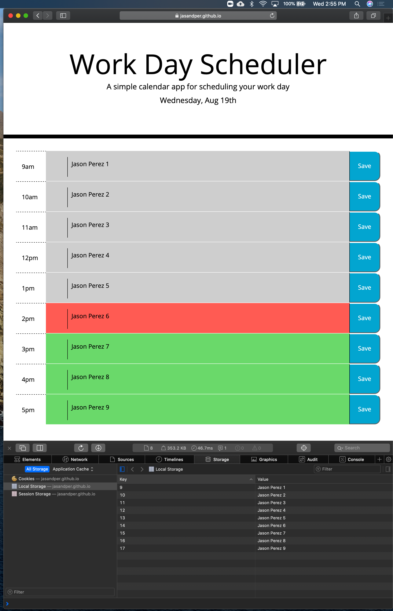

# Work-Day-Scheduler

# Description 
This application is a simple Schedule for the standard work day from the hours of 9am to 5pm.  In the heading is the current day and date in real time. 

Each hour block background color changes based on current time.  If the hour block is in the past the color is gray, if it's the current hour block the color is red and for future hours the color is green.  

Each hour block has a text area such that when text is entered by the user, that text is saved to local storage when the save button for that hour block is clicked.  When the page is rerefreshed the text reamins. 

# Technologies used
- Html, CSS, Javascript

# Link to application 
https://jasandper.github.io/Work-Day-Scheduler/

# Screenshots 

# Contact Information
Jason Perez jasandper@icloud.com

